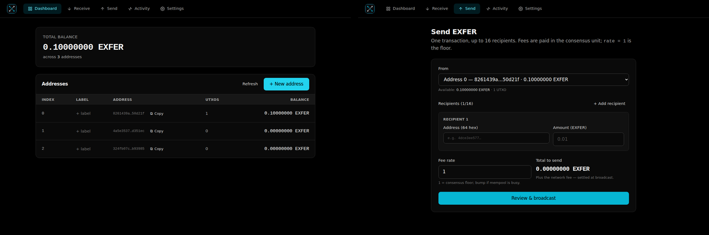

<p align="center">
  
</p>

<h1 align="center">exfer-wallet (desktop)</h1>

<p align="center">
  <a href="LICENSE"></a>
</p>

<p align="center">
  
</p>

A double-click desktop GUI for the Exfer blockchain. One executable
ships:

- the [`exfer-walletd`](https://github.com/exfer-stack/exfer-walletd)
  daemon, in-process, with a self-signed TLS cert auto-generated on
  first run;
- a small React UI for balance / generate-address / transfer /
  node-RPC settings.

The frontend never talks HTTPS directly. Every request goes
JS → Tauri IPC → Rust → loopback HTTPS to walletd, with the cert
pinned by SHA-256 fingerprint inside the Rust shell. The webview
never has to be taught to trust the self-signed cert.

Built with Tauri 2 + React 18+ + TypeScript + Vite + Tailwind.

## Architecture

```
┌── exfer-wallet (single executable) ─────────────────────────┐
│  ┌─ Tauri webview (React + TS + Tailwind) ──┐               │
│  │  Dashboard / Generate / Transfer /         │               │
│  │  Settings / PasswordPrompt                 │ ──IPC──┐     │
│  │  lib/rpc.ts → invoke('rpc', ...)            │       │     │
│  └─────────────────────────────────────────────┘       │     │
│  ┌─ Tauri Rust ───────────────────────────────────────┘     │
│  │  walletd_supervisor: keychain → run_embedded(cfg)         │
│  │  rpc_client: reqwest + rustls, fingerprint-pinned         │
│  │  embedded walletd → 127.0.0.1:<random>, TLS self-signed    │
│  └────────────────────────────────────────────────────────────┘
└───────────────────────────────────────────────────────────────┘
```

## First-run UX

- Password modal — the user picks a passphrase that encrypts the
  keystore at rest. Stored silently in the OS keychain afterwards
  (macOS Keychain, Windows Credential Manager, Linux libsecret); on
  subsequent launches walletd boots without asking.

### Mnemonics &amp; the standard scheme

New addresses are minted with the **standard** derivation scheme —
`secret = SHA-256("EXFER-MNEMONIC-ED25519-V1" || BIP39_seed(phrase))` —
the same one exfer.dev (the web wallet) and the Exfer mobile wallet use.
A phrase therefore lands on the **same address** across all three, so the
24 words you reveal here are a real cross-wallet backup of that address.

- **Reveal recovery phrase** — every address can show its own 24-word
  standard phrase (Settings → per-address). Importing it back into any
  Exfer wallet recovers the same address.
- **Import recovery phrase** (Settings) — brings in one address from its
  24 words. The phrase maps to two possible addresses (standard vs the
  older raw-key "legacy" encoding); the app previews **both with their
  on-chain balance** and defaults to the funded one, so a phrase exported
  on exfer.dev / mobile imports to the right address without guessing.
- **Import wallet.key** — the encrypted EXFK key-file path (unchanged);
  imports an externally-held address from exfer.dev / the CLI.

### Backward compatibility

- Older desktop wallets created with the legacy **HD seed**
  (`m/44'/9527'/0'/0'/i'`) still restore: the first-run "Restore from
  24-word phrase" flow seals that seed and re-derives the original HD
  addresses. New standard-scheme imports live alongside them as
  independent 1:1 keys and never touch the HD seed.
- The whole-wallet backup is a single encrypted **`.vault`** file
  (Settings → Back up &amp; restore) — it captures every address (HD +
  imported + standard) in one file, no seed phrase to copy.

- Default upstream node: `http://198.13.38.245:9334`. Editable in
  Settings; comma-separated for round-robin + failover.

## Install

Pre-built binaries are published on the
[Releases page](https://github.com/exfer-stack/exfer-walletd-desktop/releases)
for:

- Linux x86_64 — `.deb`, `.AppImage`, `.rpm`
- macOS Apple Silicon — `.dmg`, `.app.tar.gz`
- Windows x86_64 — `.exe` installer, `.msi`

**Intel macOS users**: no pre-built binary is shipped — GitHub
deprecated the `macos-13` x86_64 runner, and queue times made it
block every release. Follow the
[Build from source](#build) section below; everything works the
same, you just compile it yourself.

## Build

### Prerequisites

- Rust 1.75+ and Cargo
- Node.js 20+ and npm
- Tauri's platform prerequisites: see
  <https://tauri.app/start/prerequisites/>
  - **Linux**: `libwebkit2gtk-4.1-dev libsoup-3.0-dev pkg-config build-essential libssl-dev libgtk-3-dev libayatana-appindicator3-dev librsvg2-dev`
  - **macOS**: Xcode command-line tools
  - **Windows**: Microsoft Visual Studio C++ Build Tools + WebView2

### Dev

```bash
npm install
npm run tauri dev
```

### Release

```bash
npm install
npm run tauri build
```

Produces `.app` / `.exe` / `.AppImage` / `.deb` under
`src-tauri/target/release/bundle/`.

## Layout

```
exfer-walletd-desktop/
├── README.md
├── LICENSE
├── index.html
├── package.json, tsconfig.json, vite.config.ts
├── tailwind.config.js, postcss.config.js
├── src/                       # React frontend (TS + Tailwind)
│   ├── App.tsx                # router + bootstrap_status polling
│   ├── main.tsx, index.css
│   ├── lib/{rpc, types, toast, wallet, notify, labels, history}.ts(x)
│   ├── components/{Layout, PasswordPrompt, AddressRow, CopyButton, Reveal*Modal}.tsx
│   └── pages/{Dashboard, Receive, Send, Activity, Settings}.tsx
└── src-tauri/                 # Rust shell
    ├── Cargo.toml
    ├── tauri.conf.json
    └── src/
        ├── lib.rs             # Tauri commands + setup
        ├── main.rs
        ├── walletd_supervisor.rs   # boot / restart embedded walletd
        ├── rpc_client.rs           # pinned reqwest + JSON-RPC forwarder
        ├── secrets.rs              # OS keychain wrapper
        └── error.rs
```

## Security model

- Walletd's TLS cert is generated on first run, self-signed, with
  SAN = `127.0.0.1` + `localhost`. The Rust shell pins by SHA-256(DER)
  of the leaf — no CA, no rotation ceremony. The webview never makes
  HTTPS calls; only the Rust side handles TLS.
- Passphrase lives in the OS keychain. On Linux that's
  secret-service via libsecret. Inherits the desktop session's lock
  semantics — if you don't trust your own keychain, switch to
  `WALLETD_KEYSTORE_PASSPHRASE` prompts via a follow-up release.
- Bearer tokens are kept in the Rust shell and never sent to the
  webview. Scope mapping (read/manage/spend) mirrors walletd's
  `auth::Scope::for_method`.
- The embedded walletd binds `127.0.0.1:0` only. Public binds are
  off; you cannot accidentally expose this app to the LAN.

## License

MIT. See [LICENSE](./LICENSE).
